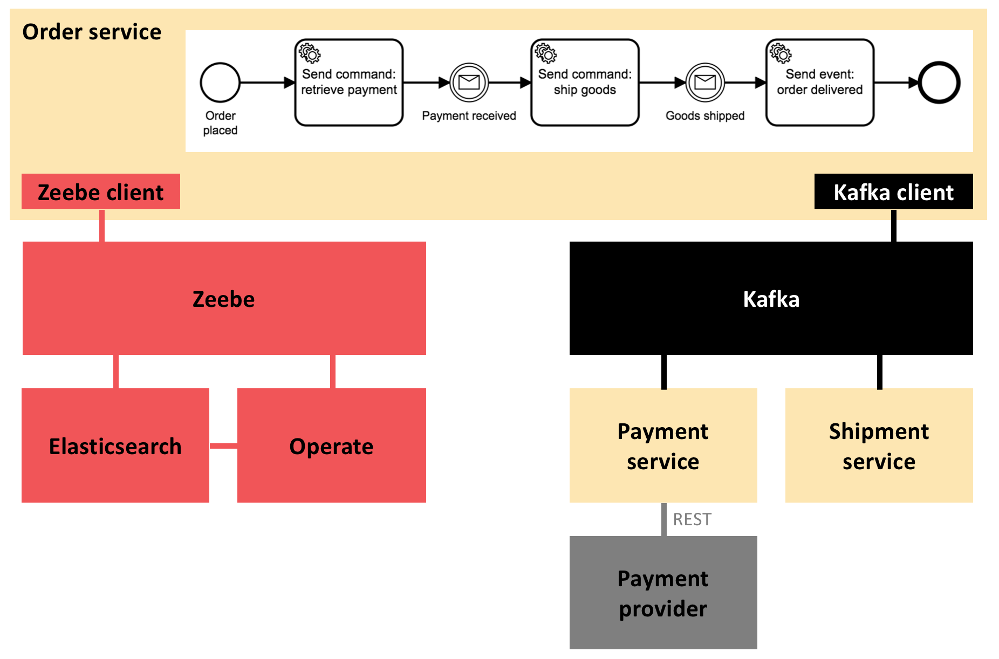
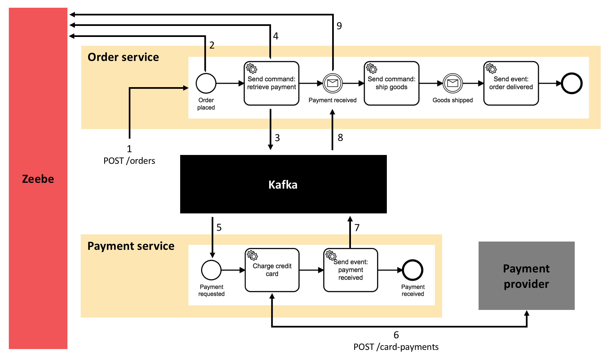

# Zeebe demo

This sample application implements a simple workflow using Zeebe as an engine for microservice orchestration and Apache Kafka for inter-service communication.

This implementation was based on the one available here:
https://github.com/berndruecker/flowing-retail

## Workflow

The workflow simulates a very simple order fulfillment system, with the business logic separated into 3 different services:


## Components



## Workflow details


1. Client calls REST endpoint from order service to start the order flow.
2. Order service creates a new workflow instance in Zeebe.
3. Zeebe triggers the next step in the flow; order service sends RetrievePaymentCommand message to Kafka.
4. Order service marks current step as completed in Zeebe.
5. Payment service receives RetrievePaymentCommand message from Kafka and triggers a new workflow instance in Zeebe.
6. Zeebe triggers the next step in the flow; payment service calls REST endpoint in payment provider; payment service marks current step as completed in Zeebe.
7. Zeebe triggers the next step in the flow; payment service sends PaymentReceivedEvent message to Kafka; payment service marks current step as completed in Zeebe.
8. Payment service receives PaymentReceivedEvent message from Kafka and marks current step as completed in Zeebe.

### Tech stack

* Java 8
* Spring Boot 2.1.x
* Spring Cloud Streams
* [Apache Kafka](https://kafka.apache.org/)
* [Zeebe](https://zeebe.io/) 0.24.x
* [Operate](https://zeebe.io/blog/2019/04/announcing-operate-visibility-and-problem-solving/) 0.24.x
* Elasticsearch

## Running the application

### Prerequisites

* [Docker](https://docs.docker.com/compose/install/)

### Running the application for the first time

* Clone this repository and go to its root folder:
```
git clone https://github.com/ccso-capco/zeebe-demo
cd zeebe-demo
```

* Run the start script:
```
./start.sh
```
This will start all containers using docker compose after building the required services and images locally.

Once all containers are up and running: 
* You can place an order at http://localhost:7080/orders
* You can inspect all instances of the workflow via Operate at http://localhost:8080
  * Username and password are both `demo`

### Applying new changes

* Run the start script for the service you have changed:
```
./start.sh <service-name>
```

### Stopping the application

* Run the stop script:
```
./stop.sh
```
This will stop and remove all the containers.

Note that any persistent volumes will be kept.
* If you want to remove persistent volumes as well then run:
```
./stop.sh --remove-volumes
```
